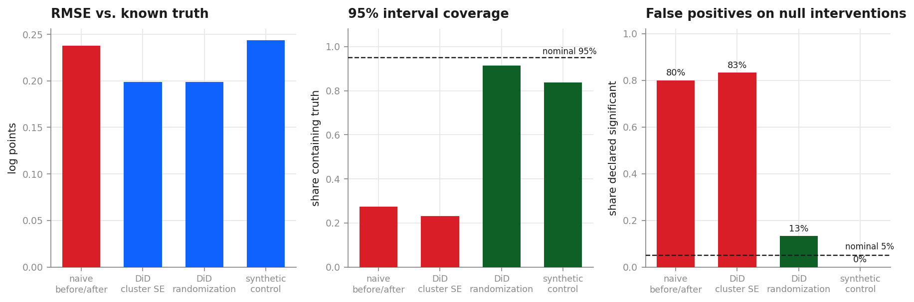
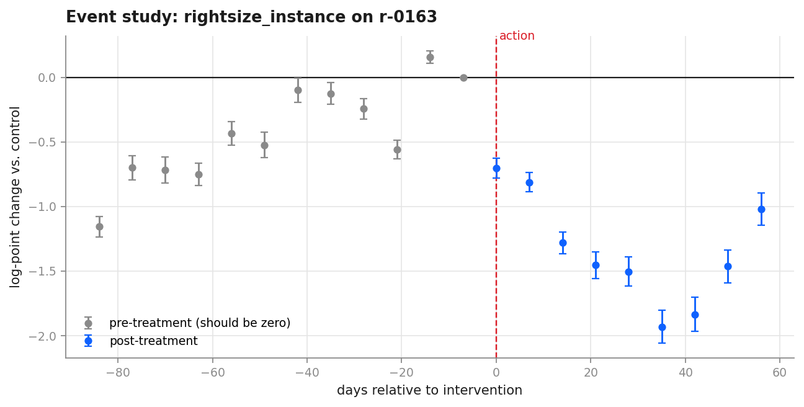
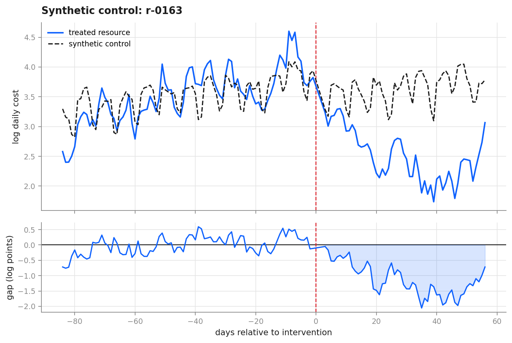

# CostProof

**The counterfactual layer for cloud and AI spend.**
Every FinOps tool on the market reports what you *spent*. None can prove what you *saved*.


---

## The 30-second version

In 2026, cloud waste rose to **29% of all spend** — the first increase in five years — while
**63% of organisations now run a dedicated FinOps team**. Those two facts do not sit
comfortably together. Either the teams are not working, or nobody can measure whether they
are.

The FinOps Foundation's 2026 survey contains a practitioner explaining the problem in their
own words:

> **"Once you fix it, it's gone… how do we give developers credit for shift-left activities?"**

That is an entire industry stating an econometric problem in plain English without
recognising it as one. They intervened, the cost went away, and they cannot observe what
the cost *would have been* had they not intervened. The quantity they want is a
**counterfactual** — unobservable by construction.

This is the fundamental problem of causal inference, described by a cloud engineer.

CostProof is the missing layer. It ingests FOCUS-standard billing data, detects waste, and
then **proves what each remediation was actually worth** using difference-in-differences and
synthetic control — and, because it runs on a simulator with known ground truth, it reports
**how accurate its own estimates are**.

---

## Headline result

Across **117 interventions** on a simulated **$8.9M/year** cloud estate, scored against the
known true effect of every one:

| Method | Bias | RMSE | 95% coverage | False positives on null interventions | Power |
|---|---:|---:|---:|---:|---:|
| Naive before/after *(the industry standard)* | 0.098 | 0.238 | 27% | **80%** | 100% |
| DiD, cluster-robust SEs | 0.066 | 0.199 | 23% | **83%** | 100% |
| **DiD, randomization inference** | **0.066** | **0.199** | **91%** | **13%** | 91% |
| Synthetic control | 0.083 | 0.244 | 84% | **0%** | 48% |

*Bias and RMSE in log points. "Null interventions" are 30 actions with a true effect of
**exactly zero**, applied to resources that had merely spiked.*

Three things to take from this table.

**1. Before/after reports a statistically significant saving on 80% of interventions that
did nothing at all.** Not 5%. Eighty. Those are actions taken on resources that happened to
spike, followed by spend reverting on its own — and the estimator credits the team for it.
This is the number that should worry a CFO.

**2. Rows 2 and 3 are the same point estimate.** Only the inference differs. Cluster-robust
standard errors are consistent as the number of *treated* clusters grows, and here there is
exactly one treated resource — so the intervals are far too narrow and cover the truth 23%
of the time. Switching to randomization inference takes coverage to 91% and cuts false
positives from 83% to 13%. Nothing about the economics changed; only the honesty of the
uncertainty did.

**3. The diagnostic works.** Splitting the identified estimates by whether they pass the
pre-trend test:

| | n | Bias | RMSE | 95% coverage |
|---|---:|---:|---:|---:|
| Passes parallel-trends test | 103 | 0.032 | **0.151** | **95.1%** |
| Fails parallel-trends test | 14 | 0.310 | 0.402 | 64.3% |

Estimates that pass have **essentially nominal coverage and less than half the error**. The
test correctly identifies which numbers to trust — demonstrated against ground truth rather
than asserted. This is what makes the system safe to put in front of finance: it knows when
to refuse to answer.

**In dollars.** On a portfolio whose true annualised saving is **$2,020,441**, the industry's
before/after method misstates the programme by **$326,700 (16%)**. The identified estimator
misstates it by **$210,954 (10%)** — and, unlike the naive method, tells you honestly how
uncertain it is.



---

## Why this is IBM's problem specifically

IBM is the largest consolidator in this market:

- **$4.6B for Apptio** (2023) — Cloudability, ApptioOne — bought explicitly to own cloud
  financial management
- **Turbonomic** — automated resource optimisation. It *takes the actions* whose value
  nobody can currently prove.
- **Kubecost** — Kubernetes cost allocation
- **TBM** — the taxonomy Apptio authored and IBM now stewards
- **watsonx / watsonx.governance** — in a market where *"AI cost management"* is the **#1
  skill gap** and *"FinOps for AI"* the **#1 forward-looking priority**

So IBM sells the tools that **take** optimisation actions and the tools that **report**
spend, and owns nothing that **substantiates the actions**. A Turbonomic customer who
automates a thousand rightsizing actions ends the quarter with a thousand unverified savings
claims.

> **The portfolio manufactures savings claims at scale and cannot substantiate any of them.
> This is the substantiation layer.**

---

## How it works

```
FOCUS 1.2 billing feed ──► panel construction ──► donor selection ──► estimation ──► scoring
   (industry standard)      (resource × day)     (match on growth)    (4 methods)   (vs truth)
```

**Data foundation.** The simulator emits billing rows conforming to the **FinOps FOCUS 1.2**
specification — the open standard AWS, Azure and GCP all publish against. Anything CostProof
ingests works on real exports unchanged. The generator models daily demand as

```
log q_it = log(base_i) + trend_i·t + weekly_i(t) + annual_i(t) + u_it + waste_it + τ_i·1[t ≥ T₀]
```

with `u_it = ρ·u_i,t-1 + ε_it` an AR(1) transitory shock. It reproduces enterprise-agreement
discounts, commitment amortisation (`EffectiveCost` vs `BilledCost`), unused commitment,
heavy-tailed resource scale, and a **10.6% untagged spend** rate.

**Treatment is assigned endogenously.** Resources are optimised *because they spiked* — which
is how real teams behave; you rightsize whatever showed up on the anomaly report. That is
selection on a high draw of a mean-reverting series, so spend falls afterward whether or not
the fix did anything. Reproducing that faithfully is what makes the whole exercise
meaningful: if treatment were random, before/after would be unbiased and there would be no
problem to solve.

**Estimation** runs four methods per intervention. The naive estimator is computed *not as an
answer* but so every report can show the gap between it and an identified estimate. That gap
is the dollar value of doing the econometrics correctly.

**Diagnostics.** Event-study plots test parallel trends before any effect is believed:



Pre-treatment coefficients sit on zero; the effect ramps in over the roll-out window, exactly
as an optimisation actually deploys. Synthetic control gives the same picture unit by unit:



---

## Two things I got wrong, and what fixed them

Both are in the git history, and both are more interesting than the result.

**The estimator was fine; the analysis window was wrong.** The first full run gave DiD
coverage of **7%** and barely beat naive. My instinct was to distrust the estimator. The
actual cause: waste was being remediated 20–75 days after it started, but the analysis
pre-window reached back **84 days** — so the "counterfactual" period was a mixture of
*waste running* and *no waste yet*, and every method understated the effect. Lengthening the
detection lag past the pre-window took DiD RMSE from 0.60 to 0.199. The lesson I actually
care about: when every method fails together, suspect the data specification, not the
methods.

**A broken variance estimate corrupted the test built on top of it.** The parallel-trends
test initially rejected for **98.3% of interventions**, including designs that visibly
satisfied it. The test was a Wald statistic built on the same cluster-robust standard errors
that are invalid with one treated unit — each t-statistic inflated, so the Wald statistic
inflated by roughly the square. Rebuilding the test on randomization inference took the pass
rate to **88%**, and the passing set turned out to have 95.1% coverage. A diagnostic
inherits every weakness of the variance estimate it is built on.

---

## What is in here

```
src/costproof/
  simulate/    FOCUS 1.2 schema + conformance validation; price book anchored to
               published list prices; ground-truth billing generator
  warehouse/   runs the SQL layers in order; idempotent by construction
  causal/      panel construction, donor selection, DiD (two-way FE, hand-rolled),
               randomization inference, synthetic control, validation harness
  ml/          waste classifier: relative features, resource-level hold-out,
               precision@k against the threshold rule most tools ship with
  agent/       tool registry with JSON schemas; TF-IDF retrieval over the runbooks;
               governed review with audit records; watsonx backend with a
               deterministic fallback; MCP server over the same registry
  report/      figures
  causal/crossval.py   exports every study panel; joins Python and R estimates
R/
  crossvalidate.R      plm within estimator + lm dummies + sandwich clustered SE
sql/
  silver_billing.sql          conform the feed; make untagged spend explicit
  gold_unit_economics.sql     cost per unit of business output, 28-day windows
scripts/
  build_business_case.py      should you buy the measurement layer? 5 sheets, NPV of decision quality
  build_finance_model.py      what did the programme deliver? 11-sheet FP&A workbook: event
                              register, attribution, budget vs actual, forecast, ROI,
                              scenarios, sensitivity, KPI dashboard -- 2,400 formulas
docs/
  00-problem.md          the business case, fully cited
  02-identification.md   the econometrics: estimand, assumptions, threats, references
  build-notes.html       running log: every step, every number, every bug and its lesson
reports/
  cost-review.md              the governed review the agent produced
  r-crossvalidation.md        117 panels, Python vs R, every coefficient side by side
  costproof-business-case.xlsx
  costproof-finance-model.xlsx
tests/                   45 tests; several encode bugs found during development, eight
                         speak MCP to the live server over stdio, one runs R, five pin
                         the model-fallback logic, and six check the finance model is
                         formulas over data with no dangling references
```

**The DiD estimator is implemented directly rather than called from a library** — the within
transformation and the cluster-robust sandwich are written out, because that is where applied
DiD most often goes wrong. It is validated two ways. Against `statsmodels` in Python it agrees
to ~1e-16. Against **R** — `plm::plm` for the within estimator, a brute-force `lm()` with
explicit unit and day dummies as a Frisch–Waugh–Lovell check, and `sandwich::vcovCL` for the
clustered standard error — it agrees on **all 117 study panels to 1.3e-13**, with a
standard-error ratio of exactly 1.00000000. R shares no code with the Python. If the two ever
disagreed, the disagreement would be the finding. See `reports/r-crossvalidation.md`.

`tests/test_simulate.py` includes regression tests for real bugs: a `None`-vs-`NaN` coercion
that silently reported a 0% untagged rate, and a SKU-scaling error that let one GPU SKU take
63% of estate spend.

---

## The agent, and what the model is not allowed to do

Everything above is measurement. `src/costproof/agent/` is what turns it into something a
finance team can run, and it is built on one rule: **the model narrates; it never
calculates.** Every number in a report comes from a function in `tools.py`, each of which
returns its value together with the method that produced it, its caveats, and its sources.
The language model chooses which tool to call and rewrites the result into prose. It
computes nothing.

That rule is enforced architecturally rather than by prompt. There are two backends behind
one interface — IBM watsonx (Granite, `ibm/granite-4-h-small`, greedy decoding, with an
ordered fallback list because foundation models get withdrawn on a schedule) and a
deterministic template that needs no credentials at all — and **the deterministic backend
produces every figure in the report**. Run the review with no API key and the numbers are
identical. If they weren't, that would be evidence the model was doing arithmetic somewhere
it shouldn't.

Three other things the agent layer does:

- **Retrieval.** Three internal documents — a remediation runbook, a measurement policy, a
  pricing reference — chunked on headings and searched with TF-IDF over word and character
  n-grams. Recall@3 is 85%: 100% when a question uses the corpus's vocabulary, 62% when
  paraphrased. The breakdown is reported rather than the average, because the gap is the
  known limit of lexical retrieval and hiding it would help nobody.
- **Governance.** Any finding over $1,000/yr, anything irreversible, anything whose owner
  cannot be established, and any savings estimate that failed its parallel-trends check is
  gated for human approval and is not executed. Three of four findings in the last run were
  gated. Every run writes a JSON audit record: backend, platform, every tool call with
  arguments and timings, every source retrieved.
- **MCP.** The same tool registry is served over the [Model Context
  Protocol](https://modelcontextprotocol.io), so Claude Desktop or any other MCP client can
  call CostProof's analytics directly. The server reads `TOOL_REGISTRY` at request time —
  one definition of what the agent may do, not two that can drift. Every tool is annotated
  read-only, every result carries its provenance and a machine-readable governance decision,
  every call is appended to an audit log, and the knowledge base and validation scorecard
  are exposed as resources. Every call is validated against the tool's published JSON
  Schema before dispatch, so a malformed call never runs and never reaches the audit log.
  A protocol-level distinction is kept deliberately: a tool that does not exist, or a call
  with invalid arguments, returns `isError: true`; a tool that ran and concluded "this
  estimate is not causal" returns `isError: false` with `ok: false`, because a refused
  savings claim is the system working, not a malfunction to retry. Targets the 2.x SDK;
  eight tests speak the protocol to the live server over stdio.

```bash
python -m costproof.cli mcp --self-test     # what a client would see
python -m costproof.cli mcp                 # serve over stdio
```

```json
{"mcpServers": {"costproof": {"command": "python",
                              "args": ["-m", "costproof.agent.mcp_server"]}}}
```

---

## The finance layer

Two Excel workbooks, generated from the pipeline's own outputs, answering two different
questions. Every figure in both is a formula off a labelled assumption cell; blue is an input,
black is a formula, green is a link. Both recalculate with zero errors.

**`costproof-business-case.xlsx` — should an organisation buy the measurement layer?** Its NPV
counts only decision quality: the engineering effort no longer wasted on scaling fixes that
did nothing. Five-year NPV **$557,508**, benefit-to-cost **6.27×**. The $115,746/yr of
reported-savings accuracy is shown and deliberately *excluded*: reporting a number more
accurately does not create cash, and a business case that books accounting accuracy as savings
is making the error this project exists to prevent.

**`costproof-finance-model.xlsx` — what did the optimisation programme deliver, measured
properly, and what is it worth?** Eleven sheets: an event register of all 117 interventions;
per-event attribution showing the before/after figure, the identified estimate, its confidence
interval, and whether it passed the parallel-trends gate; a run-rate budget against actuals by
business unit; a twelve-month forecast by two methods; programme ROI; Base/Bull/Bear; two
sensitivity grids; a KPI dashboard. 2,400 formulas.

| | |
|---|---|
| Before/after would report | $1,693,741 / yr |
| Identified, all 117 events | $1,809,487 / yr |
| **Credited — identified, parallel-trends gate** | **$1,872,634 / yr** |
| Programme NPV, 5 years, Base | $2,833,109 |
| Benefit-to-cost · ROI · IRR · payback | 2.86× · 186% · 234% · 6.5 months |
| Bear case NPV | $421,595 |

The gate produces the finding worth remembering: crediting **all** 117 estimates gives a *lower*
total than crediting only the 103 that pass parallel trends, because the 14 that fail net to
−$63K. The gate is not merely conservative; it removes noise. Two switches on the Assumptions
sheet — attribution policy and active scenario — drive every downstream number, and a test
confirms that no sheet outside the raw data contains a numeric literal.

Costs include the engineering to *execute* 117 interventions (16 hours each at a loaded
$150/hr, in year 0) and a 50% year-1 ramp, because the first draft without them produced a
0.4-month payback and a 3,067% IRR — numbers no finance reviewer would accept, and correctly so.

---

## Reproducing

```bash
pip install -e ".[dev,agent,report]"
pytest                                      # 45 tests, zero warnings (R test skips if R is absent)
python -m costproof.cli data                # generate the estate
python -m costproof.cli warehouse           # bronze -> silver -> gold (the SQL in sql/)
python -m costproof.cli study               # regenerates every number above
python -m costproof.cli review              # the governed cost review
python scripts/build_business_case.py       # the CFO workbook
python scripts/build_finance_model.py       # the FP&A workbook (recalculate in Excel on open)
python -m costproof.cli crossval            # re-estimate every panel in R; needs
                                            #   install.packages(c("plm","sandwich","data.table"))
```

Everything is deterministic given the seed in `SimConfig`. Data is regenerated rather than
committed, so nothing in this README can drift from what the code produces. watsonx is
optional: with no `.env`, the review runs on the deterministic backend and produces the same
figures.

---

## An honest statement about the data

Enterprise billing data is confidential, so CostProof runs on a simulator. This is stated up
front because a fabricated metric is the fastest way to fail an interview — the follow-up
question is always *"how did you measure that?"*

But the simulator is not a compromise. On real billing data the counterfactual is
unobservable **by definition**, which means a causal estimator can be run but never *scored*.
Simulation is what makes the central claim testable. The claim here is not *"I saved a company
$2M."* It is:

> **"Here is an estimator, and here is exactly how accurately it recovers a known truth —
> bias, RMSE, and interval coverage, measured over 117 interventions."**

That is a stronger claim, and a more honest one, than any dollar figure a portfolio project
could assert.

**Limits I have not solved**, stated plainly: spillovers between resources (rightsizing one
service can shift load to another) are screened for but not eliminated; anticipation effects
if teams throttle usage before the recorded action date; and the simulator encodes my beliefs
about how cloud spend behaves, so validation is optimistic to the extent those beliefs are
wrong. See `docs/02-identification.md §7`.

---

## Roadmap

- [x] FOCUS 1.2 schema, conformance validation, ground-truth simulator
- [x] Panel construction, growth-matched donor selection
- [x] DiD (two-way FE + cluster-robust + randomization inference), synthetic control
- [x] Validation harness: bias, RMSE, coverage, size, power, dollar misstatement
- [x] DuckDB medallion warehouse; allocation and unit economics
- [x] Waste detection and classification (benign growth vs. genuine waste)
- [x] RAG over the remediation runbook, measurement policy and pricing reference
- [x] Governed agent with human approval gate and full audit trail; watsonx backend
      with deterministic fallback
- [x] MCP server over the same tool registry, with protocol-level tests
- [x] CFO-facing Excel business case: value model, NPV, sensitivity, benefit-to-cost
- [x] FP&A finance model: event register, gated attribution, budget vs actual, forecast,
      ROI/IRR/payback, Base/Bull/Bear, sensitivity grids, KPI dashboard
- [x] Cross-validation of the causal estimates in R (`plm`, `sandwich`): 117/117 to 1e-13
- [ ] Embedding-based retrieval, to close the 62% paraphrase gap

---

## Sources

- FinOps Foundation, *State of FinOps 2026* (N=685) — https://data.finops.org/
- Flexera, *State of the Cloud 2026* (N=753), as reported — https://tech-insider.org/cloud-waste-29-percent-finops-2026/
- *FOCUS Specification v1.2* — https://focus.finops.org/focus-specification/v1-2/
- TechTarget, *IBM aims to reduce cloud costs with $4.6B Apptio acquisition* — https://www.techtarget.com/searchcloudcomputing/news/366542853/IBM-aims-to-reduce-cloud-costs-with-46B-Apptio-acquisition
- Abadie, Diamond & Hainmueller (2010); Bertrand, Duflo & Mullainathan (2004); Conley & Taber (2011); Goodman-Bacon (2021) — see `docs/02-identification.md`

MIT licensed.
